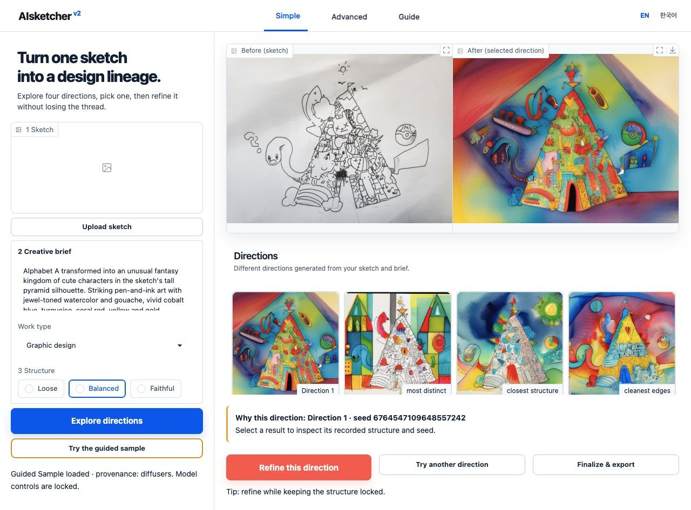

# One sketch. Many directions. One replayable decision.

AIsketcher is a model-independent Python toolkit for seed scouting, controlled
variation, and reproducible visual studies.

```text
prepare → explore → pick → vary → export → replay
```

[Try it now](getting-started.md){ .md-button .md-button--primary }
[한국어 빠른 시작](ko/quickstart.md){ .md-button }
[Choose a model](models/choosing-a-model.md){ .md-button }

[](assets/aisketcher-studio-heritage-fixed-seed-en.jpg)

*Actual local Studio with a bundled, hash-verified study. The source, four
outputs, selected seed, recipe, and manifest are included in the package. No
model is downloaded for this view.*

## See the value before downloading a model

```bash
pip install aisketcher
aisketcher try
```

The command opens a bilingual interactive tour on `127.0.0.1` using only the
base package and Python standard library. It loads no Torch, Gradio, Diffusers,
or model weights and sends no telemetry.

## Built for decisions, not isolated images

| Stage | Design question | Recorded evidence |
| --- | --- | --- |
| Prepare | Is this input usable as structure? | normalized source, control, diagnostics |
| Explore | Which directions are worth seeing? | intent, resolved recipe, candidate seeds |
| Pick | Which candidate becomes the parent? | selection and technical observations |
| Vary | What may change and what stays locked? | parent ID, strength, constraints |
| Export | Can another person inspect the work? | images, contact sheet, manifest, hashes |
| Replay | Can the run be reconstructed honestly? | model revision, runtime, drift report |

## Model roles are explicit

**Fast Edit** uses FLUX.2 Klein for photo restyling, flexible sketch
interpretation, and instruction edits. It uses a reference image rather than
Canny, so it does not promise exact line locking.

**Structure Lock** keeps the mature SDXL Canny path for strict structure and
legacy replay. Z-Image Union and Qwen Image Edit remain named candidates until
they pass the published multi-input, four-seed
[benchmark gate](models/choosing-a-model.md#the-default-model-gate).

## A backend can change without losing the study

The package separates a small generation `Backend` protocol from the study
around it. A local Diffusers model, hosted API, cloud endpoint, or in-house
pipeline can all return candidates while AIsketcher preserves the same seed,
lineage, manifest, and replay contract.

!!! warning "Artwork has a separate license"

    Code and documentation text are MIT licensed. Drawings and sample images
    are not. Read the project’s
    [artwork notice](https://github.com/hyeonsangjeon/AIsketcher/blob/main/ARTWORK_LICENSE.md)
    before using a visual asset.

## Release status

Version 0.4.0 is the current release source. Its versioned GitHub Release
publishes the same immutable README to
[PyPI](https://pypi.org/project/AIsketcher/) through Trusted Publishing.
Merges to `main` automatically
rebuild this documentation site after the strict docs checks pass. See the
[changelog](changelog.md) for details.
