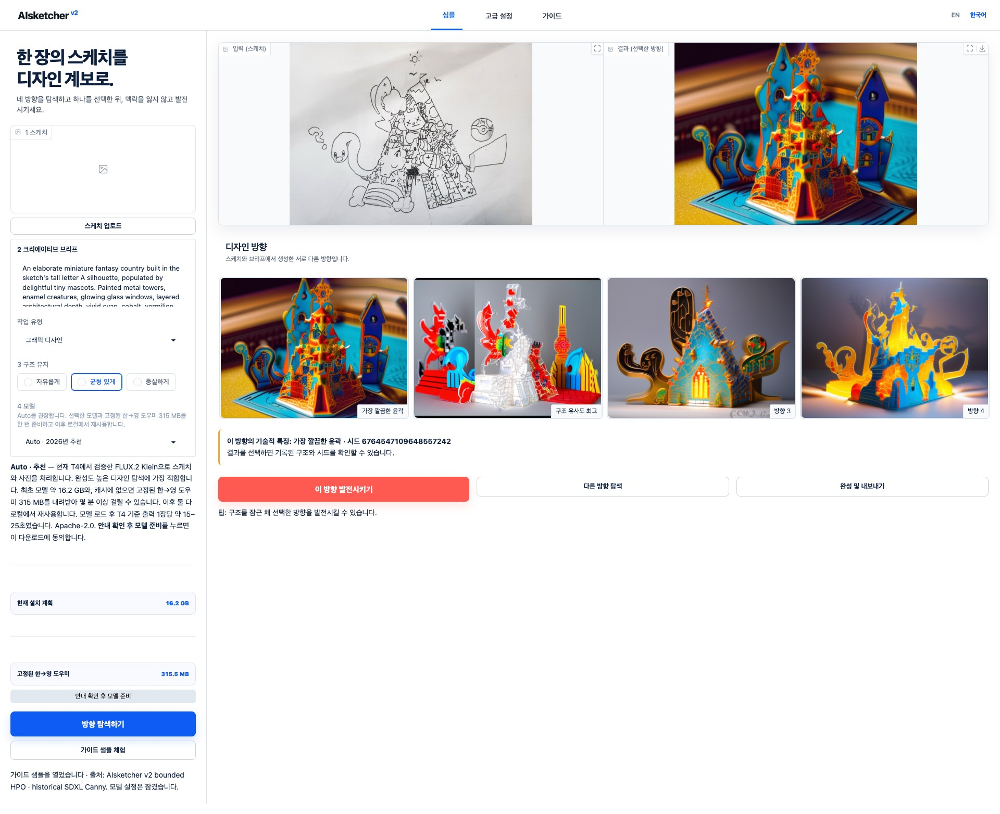

# 한국어 빠른 시작

AIsketcher는 한 장의 스케치에서 여러 디자인 방향을 탐색하고, 선택한
결과의 변형과 재현 정보를 함께 보존하는 Python SDK입니다.

```text
준비 → 탐색 → 선택 → 변형 → 내보내기 → 재현
```

## 설치

AIsketcher 0.3.0은
[PyPI](https://pypi.org/project/AIsketcher/0.3.0/)에서 설치할 수 있습니다.
나중에 패키지가 갱신되어도 같은 환경을 만들 수 있도록 버전을 고정합니다.
PyPI 패키지명은 대소문자를 구분하지 않지만 Python import와 CLI에 맞춰 설치
대상은 소문자 `aisketcher`로 표기합니다.

최신 버전은 다음 한 줄로 설치합니다.

```bash
pip install aisketcher
```

동일한 환경을 재현하려면 아래처럼 공개 버전을 고정합니다.

기본 패키지에는 Torch, Diffusers, 모델 파일, Gradio 실행 환경이 포함되지
않습니다. Studio 코드와 가이드 샘플은 기본 wheel에 들어 있으며 `demo`
선택 의존성이 화면을 실행할 Gradio 환경을 추가합니다.

```bash
python -m pip install "aisketcher==0.3.0"
```

로컬 이미지 생성 기능은 선택 의존성으로 추가합니다.

```bash
python -m pip install "aisketcher[local]==0.3.0"
```

Studio 화면을 사용하려면 `demo` 선택 의존성을 설치합니다.

```bash
python -m pip install "aisketcher[demo]==0.3.0"
aisketcher init
aisketcher studio
```

한 줄로 처음 실행하려면 다음 명령을 사용합니다. 이미 설정 파일이 있다면
`aisketcher init &&` 부분은 빼세요.

```bash
python -m pip install "aisketcher[demo]==0.3.0" && aisketcher init && aisketcher studio
```

`init`은 최초 한 번 버전이 명시된 사용자 YAML 설정을 만들며 모델을 받지 않습니다.
기존 파일은 보호하고, 다른 위치가 필요할 때만 `--path`를 사용합니다.
Studio의 **Guided Sample**은 패키지에 포함된 익명 source, 기록된 SDXL
Canny control, 네 개의 실제 로컬 생성 후보, 선택 정보, 검증용 manifest를
읽기 전용으로 엽니다. 따라서 모델이나 네트워크 없이 바로 사용할 수
있습니다. 이 샘플은 역사적 레시피의 출처를 보존하는 자료이며 새 작업의
기본 모델을 뜻하지 않습니다.

새 설정의 추천/기본 모델은 T4에서 검증한 **FLUX.2 Klein Edit**입니다.
SDXL Canny Lite와 Quality는 기존 manifest 재현이나 명시적인 edge
conditioning 작업을 위한 Legacy 옵션으로 남습니다. 어느 모델이든 설치
계획과 라이선스를 확인하고 **안내 확인 후 모델 준비**를 눌러야만 첫
다운로드가 시작됩니다. 이 한 번의 확인은 선택한 이미지 모델과, 캐시에
없을 때 고정된 한→영 도우미 315 MB를 함께 준비합니다.

실제 로컬 생성과 Studio를 함께 설치하려면 다음 명령을 사용합니다.

```bash
python -m pip install "aisketcher[local,demo]==0.3.0"
```

## 기본 흐름

```python
from aisketcher import FakeBackend, Intent, PresetManager, SeedPlan, Studio

preset = "flux2-klein-edit@1"
models = PresetManager()
plan = models.plan_install(preset)
print(plan.license_notice, plan.estimated_bytes, plan.download_bytes, plan.items)

# 저장소, revision, 예상 용량, 모델 라이선스를 확인한 뒤에만 실행합니다.
if not plan.installed:
    models.install(preset, confirm=True)

studio = Studio.from_preset(preset, device="auto", preset_manager=models)
prepared = studio.prepare("sketch.jpg")

original_brief = "종이 공예 느낌의 친근한 판타지 왕국"
model_brief = "A friendly fantasy kingdom made from layered paper craft"
study = studio.explore(
    prepared,
    intent=Intent(
        prompt=original_brief,
        model_prompt=model_brief,
        prompt_metadata={
            "normalization": {
                "status": "manually-prepared",
                "source_language": "ko",
            }
        },
        profile="graphic_design",
        structure="balanced",
    ),
    outputs=4,
    seed_plan=SeedPlan.scout(4),
)

selected = study.pick(1)  # 0부터 세는 고정 인덱스이므로 두 번째 후보입니다.
variations = studio.vary(
    selected,
    outputs=4,
    strength="subtle",
    locks=("structure",),
)
variations.export("design-study")
```

모델을 받지 않고 API와 계보 저장만 시험하려면
`Studio(FakeBackend(), preset="sdxl-canny-lite@1")`를 사용할 수 있습니다.
이 결과는 코드 검증용 결정론적 fixture이며 생성 모델의 창작 결과가
아닙니다. 여기서 SDXL preset 이름을 명시한 것은 기존 fixture 계약을
유지하기 위한 것이며 새 라이브 작업의 기본값과는 별개입니다.

기본 출력은 네 장입니다. seed는 작품의 품질 점수가 아니라 한 번의
탐색을 다시 찾기 위한 좌표에 가깝습니다. AIsketcher는 실제 사용한 seed와
해석된 설정을 manifest에 기록합니다.

## Simple과 Advanced

- **Simple**: 스케치, 한 문장 설명, 작업 유형,
  `Loose / Balanced / Faithful`을 선택하고 추천 모델의 용도와 캐시 상태를
  확인합니다. 기본 선택은 FLUX.2 Klein Edit입니다.
- **Advanced**: 모델, control 방식, seed, 출력 수, 변형 강도, lock, 재현
  설정을 조절합니다. Canny 항목은 Legacy SDXL preset에만 적용되고 FLUX.2는
  입력 이미지를 reference로 사용합니다.

두 화면은 같은 작업 상태를 공유합니다. Advanced에서 값을 변경한 뒤
Simple로 돌아오면 `Advanced overrides active` 표시와 초기화 버튼이
나타납니다.

탐색 결과 네 장은 내부 스크롤바 없이 큰 카드로 표시됩니다. 각 카드를
누르면 원본 비율의 이미지를 크게 확인할 수 있습니다. 라이브 결과에서
**이 방향 발전시키기**를 누르면 추가 요청 입력란이 열립니다. 읽기 전용
가이드 샘플에서 같은 버튼을 누르면 오류 대신 추천 모델, 첫 다운로드,
캐시 재사용, 라이선스를 설명하는 레이어가 열립니다. **샘플 계속
둘러보기**를 누르면 선택과 샘플을 그대로 둔 채 레이어만 닫힙니다.

[](../assets/aisketcher-studio-guided-sample-ko.jpg)

*모델 없이 번들 가이드 샘플을 연 실제 로컬 화면입니다. 이미지를 누르면
크게 볼 수 있습니다. 왼쪽의 빈 입력란은 새 작업용이고 오른쪽에는 읽기
전용 fixture가 열려 있습니다. 모델 없이 비교·선택·내보내기를 체험할 수
있고, 새 탐색과 발전은 로컬 preset을 준비해 별도 study에서 진행합니다.*

## 한국어 원문과 모델 프롬프트

Studio는 사용자가 쓴 한국어를 원문으로 보존하고, 이미지 모델에 전달할
영어 프롬프트를 별도 필드로 준비합니다. 고정된 로컬 한→영 번역 adapter를
사용자가 명시적으로 준비해 두면 번역 결과, adapter ID와 revision, 이후
추가한 발전 요청을 manifest에 각각 기록합니다. FLUX.2 경로에서는 입력
이미지를 보존하고 요청한 변경만 적용하도록 결정론적인 edit 제약도 모델
프롬프트에 추가됩니다.

번역 실행 의존성은 `aisketcher[translate]` 또는 `aisketcher[local]`에
포함되지만, 번역 모델 파일을 몰래 내려받지는 않습니다. 고정된 번역
adapter가 로컬 캐시에 없으면 Studio는 GPU 작업 전에 멈추고 모델 준비
레이어에서 이미지 모델과 도우미의 용량·revision·라이선스를 함께
보여줍니다. **안내 확인 후 모델 준비**를 눌러야만 진행되며, 그 전에
샘플로 돌아가거나 설정 화면을 벗어나면 다운로드하지 않습니다. 이때
한국어 원문은 보존되며 준비 전에는 이미지 모델로 전송되지 않습니다.
검토한 영문 프롬프트를 직접 입력할 수도 있습니다.

Python SDK는 애플리케이션 정책을 대신 정하지 않으므로 위 예제처럼
`prompt`에 원문, `model_prompt`에 검토한 모델용 문장을 명시할 수 있습니다.

## 첫 다운로드와 작업 중지

캐시에 없는 모델을 고르면 바로 다운로드하지 않습니다. repository와
고정 revision, 예상 전송량, 저장 위치, 장치 조건, 라이선스를 확인한 뒤
별도 동의 버튼을 눌러야 합니다. FLUX.2 Klein Edit의 첫 다운로드는 약
16.2 GB이고 한→영 도우미가 없으면 약 315 MB가 추가되며, 이후에는 같은
로컬 캐시를 재사용합니다. 패키지 Studio는 이미지 모델을 해당 캐시의
`models/`, 한→영 도우미를 `translation/` 아래에 저장합니다. 따라서
별도 Hugging Face 전역 캐시에 우연히 남아 있는 파일에 의존하지 않고,
Studio에서 준비한 도우미를 오프라인 재실행에서도 같은 설정으로 찾습니다.

다운로드나 생성 중에는 브라우저 새로고침 대신 **작업 중지**를 누르세요.
대기 중인 작업은 즉시 제거되고, 생성은 backend step 또는 출력 경계에서
협력적으로 종료됩니다. 모델 다운로드는 현재 전송 중인 tensor 파일이
끝난 뒤 다음 선택 파일 경계에서 멈춥니다. 고정 revision과 허용 파일
정책을 만족해 완료 마커가 생긴
component는 캐시에 남고 불완전한 미표시 폴더는 정리되므로, 다시 시도하면
누락된 파일만 받습니다. 이 완료 마커와 정리 보장은 이미지 모델에
적용됩니다. 한→영 도우미는 고정 revision의 Transformers 캐시를 사용하며
tokenizer와 모델 로드 사이에서 중지를 확인합니다.

같은 브라우저 세션이 다시 연결되면 Studio는 아직 실행 중이거나 중지 중인
작업과 **작업 중지** 버튼을 복원합니다. 새로고침만으로 GPU 작업이
취소되지는 않습니다. 임시 서버 자체가 종료되었다면 복구 레이어의 안내에
따라 가장 최근 Studio 주소만 다시 여세요.

화면의 `42.3 / 107.6초` 같은 표시는 `경과 시간 / 예상 시간`입니다.
107.6초에 강제로 종료된다는 뜻이 아닙니다.

패키지 Studio는 `127.0.0.1`에만 열리는 로컬 1인용 도구입니다. 브라우저
세션별 작업 상태는 분리하지만 GPU 작업은 프로세스 전체에서 하나씩
수행합니다. 인증·보관 정책이 없는 상태로 여러 사용자나 인터넷에 공개하는
서비스 용도가 아닙니다.

## 알아둘 점

- 누구에게나 좋은 “추천 seed”는 없습니다. 구조 일치, edge 상태, 후보
  중복도 같은 기술적 관찰만 배지로 제공합니다.
- strict replay는 입력과 모델 revision이 달라지면 중단합니다. compatible
  replay는 대체된 항목을 보고하고 계속할 수 있습니다.
- 기본 내보내기는 이미지를 EXIF 없이 다시 저장하고, source 파일명을 빼며,
  backend metadata를 허용 목록으로 제한합니다. prompt, profile, custom backend
  식별자에는 token이나 비공개 경로를 넣지 마세요.
- 예제 드로잉과 결과 이미지는 MIT 라이선스 대상이 아닙니다.

다음으로 [전체 SDK 흐름](../sdk/workflow.md),
[seed와 출력 개수](../guides/seeds.md),
[환경설정 레퍼런스](../reference/configuration.md),
[문제 해결](../guides/troubleshooting.md),
[개인정보와 자산 처리](../guides/privacy.md)를 읽어보세요.
