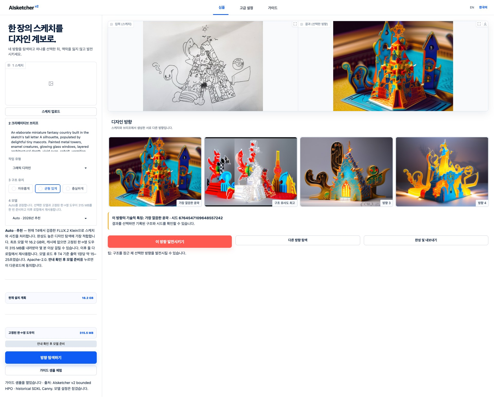

# 한국어 빠른 시작

AIsketcher는 한 장의 스케치에서 여러 디자인 방향을 탐색하고, 선택한
결과의 시드·계보·모델 revision·재현 정보를 함께 보존하는 Python
도구입니다.

```text
준비 → 탐색 → 선택 → 변형 → 내보내기 → 재현
```

[](../assets/aisketcher-studio-guided-sample-ko.jpg)

*모델 다운로드 없이 열리는 실제 한국어 가이드 스터디 화면입니다. 이미지를
누르면 크게 볼 수 있습니다.*

## 1. 모델 없이 실제 스터디 열기

```bash
python -m pip install "aisketcher==0.4.0"
aisketcher try
```

가장 먼저 권하는 실행 방법입니다. 패키지에 포함된 실제 스터디를
`127.0.0.1`의 한국어·영어 인터랙티브 화면으로 엽니다. 각 후보를 눌러
시드와 기록 정보를 볼 수 있습니다. GPU, 외부 네트워크 연결, Torch, Diffusers,
Gradio, 모델 다운로드가 필요 없고 사용 정보를 외부로 보내지 않습니다.
종료할 때는 터미널에서 `Ctrl+C`를 누르세요.

## 2. 필요한 기능만 설치하기

기본 SDK와 빠른 체험만 설치합니다.

```bash
python -m pip install "aisketcher==0.4.0"
```

가이드 스터디가 포함된 전체 Studio 화면을 추가합니다.

```bash
python -m pip install "aisketcher[demo]==0.4.0"
aisketcher init --language ko
aisketcher studio
```

로컬 모델 생성까지 사용하려면 다음처럼 설치합니다.

```bash
python -m pip install "aisketcher[local,demo]==0.4.0"
aisketcher init --language ko
aisketcher studio
```

`init`은 버전이 명시된 YAML 설정 원장을 처음 한 번 만들며 모델을 받지
않습니다. 기존 파일은 보호합니다. 프로젝트별 파일이 필요할 때만
`--path`를 사용하세요. 자세한 내용은
[환경설정 레퍼런스](../reference/configuration.md)에 있습니다.

## 3. 모델 이름보다 역할을 고르기

- **빠른 편집 · FLUX.2 Klein**은 사진 스타일 변경, 유연한 스케치 해석,
  지시 기반 편집에 적합합니다. 참조 이미지 편집 모델이며 Canny를
  사용하거나 선을 정확히 잠그는 모델은 아닙니다.
- **구조 잠금 · SDXL Canny Lite**는 최신 편집 품질보다 스케치 선을
  엄격히 유지해야 할 때 쓰는 저용량 레거시 폴백입니다.
- **구조 잠금+ · SDXL Canny**는 전체 레거시 ControlNet을 사용합니다.

기존 `Auto`는 입력 종류를 분류하지 않고 모든 작업을 FLUX.2로 보냈습니다.
0.4부터는 오해를 막기 위해 실제 모델 역할을 그대로 표시합니다. 현대적인
구조 모델 Z-Image Union과 고성능 Qwen 후보는
[모델 선택 가이드](../models/choosing-a-model.md)의 다중 입력·4시드
벤치마크를 통과한 뒤에만 기본값으로 승격합니다.

모델 준비 버튼을 누르면 다운로드 전에 장치 지원, CUDA 메모리, 캐시 여유
공간을 먼저 확인합니다. 실행할 수 없는 CPU/MPS 조합에서는 수십 GB를
받기 전에 중단합니다. 영어 화면은 이미지 모델만 준비하며, 한국어 화면은
한국어 브리프용으로 고정된 한→영 도우미도 함께 준비합니다.

## 4. Python에서 스터디 실행하기

```python
from aisketcher import Intent, PresetManager, SeedPlan, Studio

preset = "flux2-klein-edit@1"
models = PresetManager()
plan = models.plan_install(preset)
print(plan.download_bytes, plan.items, plan.license_notice)

if not plan.installed:
    models.install(preset, confirm=True)

studio = Studio.from_preset(preset, device="auto", preset_manager=models)
prepared = studio.prepare("sketch.jpg")

study = studio.explore(
    prepared,
    intent=Intent(
        prompt="종이 공예로 만든 귀여운 판타지 마을",
        model_prompt="A cute fantasy village made from layered paper craft",
        prompt_metadata={
            "detected_language": "ko",
            "status": "user-provided-model-prompt",
            "translator": None,
        },
        profile="graphic_design",
        structure="balanced",
    ),
    outputs=4,
    seed_plan=SeedPlan.scout(4),
)

selected = study.pick(1)
variations = studio.vary(
    selected,
    outputs=4,
    strength="subtle",
    locks=("structure",),
)
variations.export("design-study")
```

위 Python SDK 예제처럼 한국어 원문을 직접 사용할 때는 검토한 영어
`model_prompt`를 명시하세요. SDK 자체는 브리프를 자동 번역하지 않습니다.
한국어 Studio는 입력한 원문과 모델에 전달한 영어를 별도로 기록합니다.
고정된 로컬 도우미와 용어 보호 규칙을 사용하지만, 모든 한국어 표현을
완벽하게 번역한다고 보장하지는 않습니다.

## 작업 중 알아둘 점

- 가이드 스터디와 `aisketcher try`는 읽기 전용이며 모델을 받지 않습니다.
- 실제 모델 준비 전에는 repository, revision, 용량, 저장 위치, 라이선스를
  보여줍니다.
- 다운로드나 생성 중에는 새로고침 대신 **작업 중지**를 누르세요.
- 같은 브라우저 세션이 다시 연결되면 실행 중인 작업과 중지 버튼을
  복원합니다. 새로고침만으로 GPU 작업이 취소되지는 않습니다.
- `42.3 / 107.6초`는 `경과 시간 / 예상 시간`이지 강제 종료 시간이 아닙니다.
- 패키지 Studio는 `127.0.0.1`에만 열리는 로컬 1인용 도구입니다.

다음으로 [전체 SDK 흐름](../sdk/workflow.md),
[시드와 출력 개수](../guides/seeds.md),
[환경설정](../reference/configuration.md),
[문제 해결](../guides/troubleshooting.md)을 읽어보세요.
