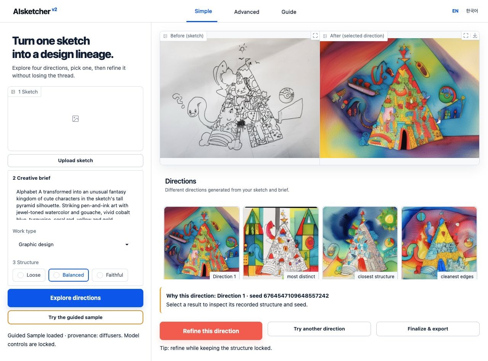

# Simple and Advanced Studio

The Gradio Studio is an MVP interface over the same package API. Simple and
Advanced are two views of one canonical recipe and one selection history. The
Studio code, console command, and reviewed Guided Sample are packaged in the
base wheel; the `demo` extra adds the Gradio runtime needed to launch them.

```bash
python -m pip install "AIsketcher[demo]==0.2.1"
aisketcher init  # First run only; omit when settings already exist.
aisketcher studio
```

Use `aisketcher studio --config /path/to/aisketcher.yaml` for one explicit
project override, or `--language en|ko` for a session language override. The
normal configuration order is documented in the
[configuration reference](../reference/configuration.md).

For development, `python -m examples.studio_app.app` remains a thin compatibility
entry point over the packaged app in an editable checkout.

[](../assets/aisketcher-studio-heritage-fixed-seed-en.jpg)

*Actual local English Studio. Select the screenshot to open it full size.*

For this capture, Studio was launched with a documentation-only,
privacy-reviewed family-sketch fixture. The visible prompt, profile, and
structure settings come from its authenticated manifest, and the HPO-selected
direction is fixed to seed `6764547109648557242` with pinned preset
`sdxl-canny-lite@1`. Twelve new candidates were reviewed in four bounded rounds
before selection. This fixture is separate from the bundled Pocket Kingdom
Guided Sample. Model weights were already local, so the capture caused no model
download or image upload.

## Simple is the default

Simple asks for:

1. a sketch;
2. a one-sentence creative brief;
3. a work profile;
4. Loose, Balanced, or Faithful structure.

It creates four candidates, preserves their generation order, and lets you
enlarge any input or result. After picking a direction, choose
**Refine this direction**, **Try another direction**, or
**Finalize & export**.

Simple always uses the reviewed Lite recipe with a four-seed Scout. Project
configuration and Advanced controls remain available in the Advanced view, but
cannot silently change this four-direction Simple experience.

Model names, raw seeds, Canny parameters, steps, and guidance are intentionally
absent from the default view.

## Advanced reveals the resolved controls

Advanced adds model/preset, required Canny-control status, steps, guidance,
seed mode, output count, variation strength, a structure lock,
manifest export, and replay. Exact Canny thresholds remain available through
the Python API rather than the MVP Studio.

**Auto** produces a deliberate scout set, **Locked seed** runs one recorded
63-bit starting value, and **Custom seeds** accepts one value per requested
output. Locked mode sets the output count to one; use it for controlled
comparisons, not for discovering four directions.

Returning to Simple does not discard those values, but Simple runs its fixed
four-direction Scout instead of applying them invisibly. If an Advanced
override is active, Simple displays **Advanced overrides active** and offers one
explicit reset action.

## Guided Sample

Guided Sample teaches the entire interaction without model weights, a network,
or a GPU. It activates only when the bundle contains a valid manifest and every
referenced source and candidate. Inputs and prompts are locked to the fixture;
changing either starts the local-model path instead of pretending the fixture
was generated from new input.

The package includes the reviewed anonymous source, exact prepared
input and Canny control, four real locally generated candidates, selected
direction, and matching manifest. Guided Sample is available immediately after
installing the `demo` extra and always remains read-only. To refine or explore,
prepare a local model and start a new study instead of altering the fixture.

## Local-only safety defaults

- The server binds to `127.0.0.1` and does not create a public share link.
- Generation concurrency is one; a shared model pool serves session-isolated
  workspaces.
- Uploads are limited to 20 MB and 50 megapixels.
- Anonymous model installation and arbitrary model URL inputs are not exposed.
- Interface text can switch between English and Korean.

Add the `local` extra only when live generation is needed.

See [Troubleshooting](../guides/troubleshooting.md) for missing extras, fixture
integrity failures, device limits, upload limits, and replay drift.
